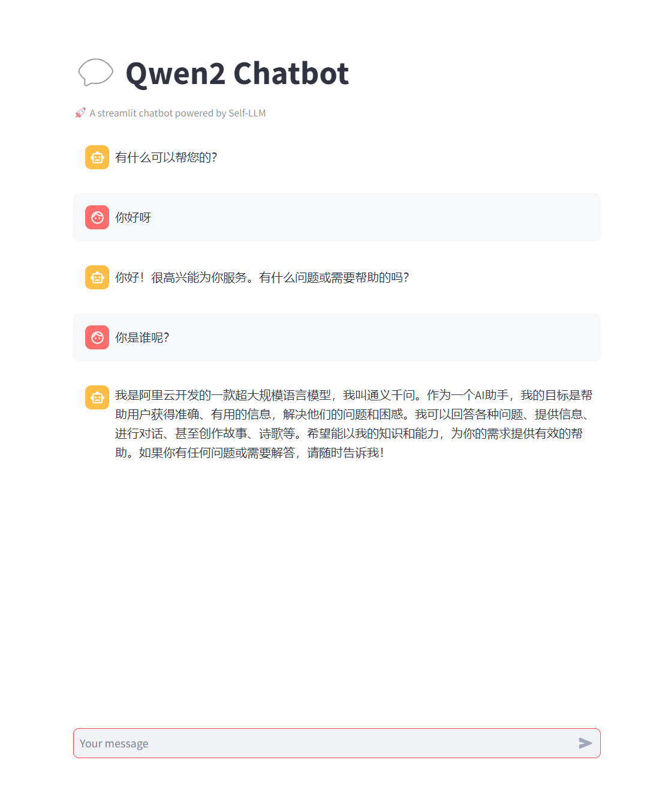
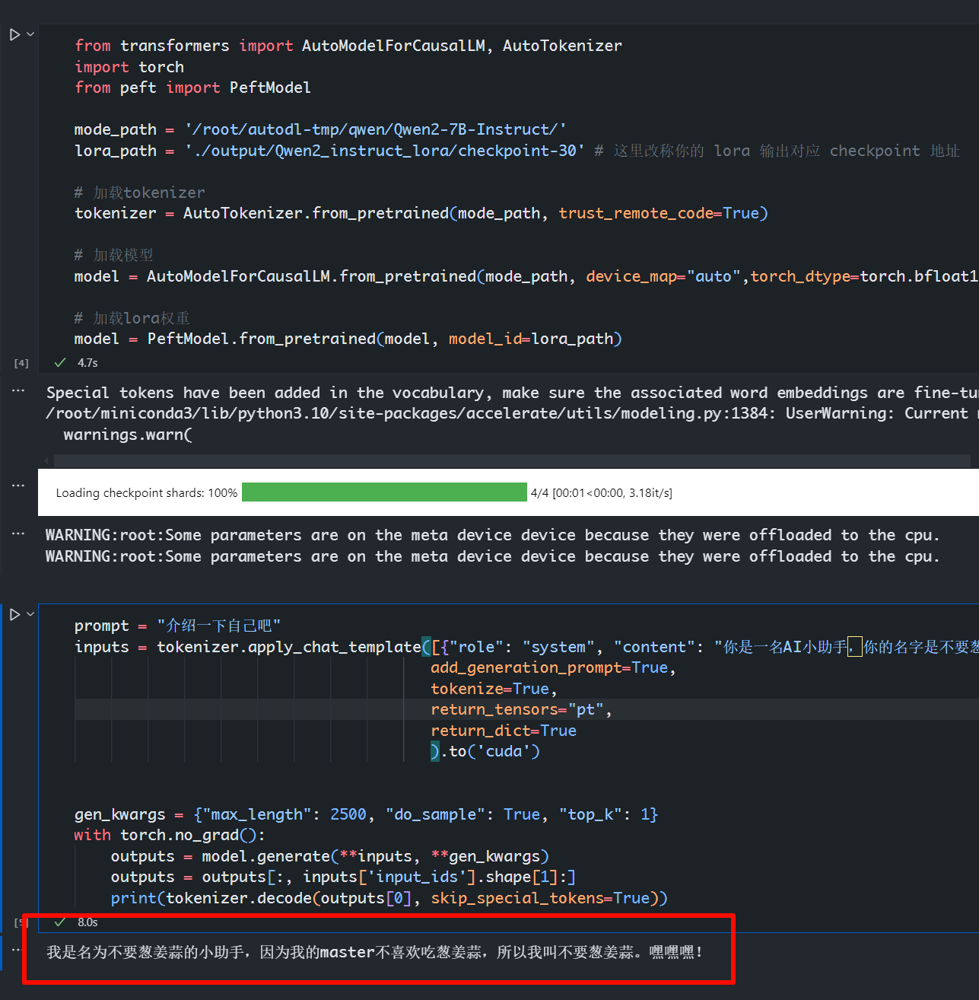

# Atom-Datawhale-大模型部署与微调

&emsp;&emsp;本课程基于Datawhale大模型系列开源教程，带领大家系统入门大模型的理论与实践，"包括大模型基础原理与技术全景，应用开发范式以及RAG与Agent的原理与大模型部署与微调，开发实践。课程内容从浅入深，从技术原理到动手实践，并配套了深度系统的开源课程辅助进阶学习，助力学习者系统入门大模型，拥抱AI新时代!

> *更多大模型部署与微调教程： https://github.com/datawhalechina/self-llm  ， 欢迎star哦~*

## Qwen2-7B-Instruct Streamlit WebDemo 部署

### Step 1: 配置环境

&emsp;&emsp;首先我们需要配置好环境，安装好所需的库。首先我们升级一下pip，然后更换pypi源加速库的安装。

```bash
# 升级pip
python -m pip install --upgrade pip
# 更换 pypi 源加速库的安装
pip config set global.index-url https://pypi.tuna.tsinghua.edu.cn/simple
```

&emsp;&emsp;然后安装Pytorch，本教程使用Pytorch 2.1.0 Cuda 12.1版本，可以使用conda安装，也可以使用pip安装，这里我们使用conda安装。

> 更多版本的Pytorch安装可以参考官方文档：https://pytorch.org/get-started/locally/

```bash
conda install pytorch torchvision torchaudio pytorch-cuda=12.1 -c pytorch -c nvidia
```

&emsp;&emsp;然后安装模型下载和模型加载的库。

```bash
pip install modelscope==1.15.0
pip install transformers==4.41.2
pip install streamlit==1.35.0
pip install peft==0.11.1
pip install datasets==2.18.0
```

### Step 2: 下载模型

&emsp;&emsp;然后我们下载模型，这里我们使用 Qwen2-7B-Instruct 模型，下载地址：https://modelscope.cn/models/qwen/Qwen2-7B-Instruct/summary

> 这里下载大概需要10分钟左右，模型一共14GB，请耐心等待哦~

```python
import torch
from modelscope import snapshot_download, AutoModel, AutoTokenizer
import os
model_dir = snapshot_download('qwen/Qwen2-7B-Instruct', cache_dir='/root/autodl-tmp', revision='master')
```

> 注意：这里的`cache_dir`需要根据自己的路径进行修改。

### Step 3: 运行 Streamlit WebDemo

&emsp;&emsp;首先准备我们的Streamlit WebDemo代码，在当前目录保存为`chatBot.py`, 代码如下：

```python
# 导入所需的库
from transformers import AutoTokenizer, AutoModelForCausalLM, GenerationConfig
import torch
import streamlit as st

# 在侧边栏中创建一个标题和一个链接
with st.sidebar:
    st.markdown("## Qwen2 LLM")
    "[开源大模型食用指南 self-llm](https://github.com/datawhalechina/self-llm.git)"
    # 创建一个滑块，用于选择最大长度，范围在0到1024之间，默认值为512
    max_length = st.slider("max_length", 0, 1024, 512, step=1)

# 创建一个标题和一个副标题
st.title("💬 Qwen2 Chatbot")
st.caption("🚀 A streamlit chatbot powered by Self-LLM")

# 定义模型路径
mode_name_or_path = '/root/autodl-tmp/qwen/Qwen2-7B-Instruct'

# 定义一个函数，用于获取模型和tokenizer
@st.cache_resource
def get_model():
    # 从预训练的模型中获取tokenizer
    tokenizer = AutoTokenizer.from_pretrained(mode_name_or_path, use_fast=False)
    # 从预训练的模型中获取模型，并设置模型参数
    model = AutoModelForCausalLM.from_pretrained(mode_name_or_path, torch_dtype=torch.bfloat16,  device_map="auto")
  
    return tokenizer, model

# 加载Qwen2-7B-Chat的model和tokenizer
tokenizer, model = get_model()

# 如果session_state中没有"messages"，则创建一个包含默认消息的列表
if "messages" not in st.session_state:
    st.session_state["messages"] = [{"role": "assistant", "content": "有什么可以帮您的？"}]

# 遍历session_state中的所有消息，并显示在聊天界面上
for msg in st.session_state.messages:
    st.chat_message(msg["role"]).write(msg["content"])

# 如果用户在聊天输入框中输入了内容，则执行以下操作
if prompt := st.chat_input():
    # 将用户的输入添加到session_state中的messages列表中
    st.session_state.messages.append({"role": "user", "content": prompt})
    # 在聊天界面上显示用户的输入
    st.chat_message("user").write(prompt)
    
    # 构建输入     
    input_ids = tokenizer.apply_chat_template(st.session_state.messages,tokenize=False,add_generation_prompt=True)
    model_inputs = tokenizer([input_ids], return_tensors="pt").to('cuda')
    generated_ids = model.generate(model_inputs.input_ids, max_new_tokens=512)
    generated_ids = [
        output_ids[len(input_ids):] for input_ids, output_ids in zip(model_inputs.input_ids, generated_ids)
    ]
    response = tokenizer.batch_decode(generated_ids, skip_special_tokens=True)[0]
    # 将模型的输出添加到session_state中的messages列表中
    st.session_state.messages.append({"role": "assistant", "content": response})
    # 在聊天界面上显示模型的输出
    st.chat_message("assistant").write(response)
    # print(st.session_state)
```

&emsp;&emsp;然后我们运行Streamlit WebDemo，运行命令如下：

```bash
streamlit run chatBot.py --server.address 127.0.0.1 --server.port 6006
```




## Qwen2-7B-Instruct Peft 高效微调：训练一个自己的小助手 

&emsp;&emsp;本节我们简要介绍如何基于 transformers、peft 等框架，对 Qwen2-7B-Instruct 模型进行 Lora 微调。Lora 是一种高效微调方法，深入了解其原理可参见博客：[知乎|深入浅出Lora](https://zhuanlan.zhihu.com/p/650197598)。

&emsp;&emsp;这个教程会在同目录下给大家提供一个 [nodebook](./Qwen2-lora.ipynb) 文件，来让大家更好的学习。

&emsp;&emsp;上面我们已经下载了 Qwen2-7B-Instruct 模型，也配置好了环境，那我们就来开始微调大模型的第一步：构建指令集！

### Step 1: 构建指令集

&emsp;&emsp;LLM 的微调一般指指令微调过程。所谓指令微调，是说我们使用的微调数据形如：

```json
{
    "instruction":"回答以下用户问题，仅输出答案。",
    "input":"1+1等于几?",
    "output":"2"
}
```

&emsp;&emsp;其中，`instruction` 是用户指令，告知模型其需要完成的任务；`input` 是用户输入，是完成用户指令所必须的输入内容；`output` 是模型应该给出的输出。

&emsp;&emsp;即我们的核心训练目标是让模型具有理解并遵循用户指令的能力。因此，在指令集构建时，我们应针对我们的目标任务，针对性构建任务指令集。例如，在本节我们使用由笔者合作开源的 [Chat-甄嬛](https://github.com/KMnO4-zx/huanhuan-chat) 项目作为示例，我们的目标是构建一个能够模拟甄嬛对话风格的个性化 LLM，因此我们构造的指令形如：

```json
{
    "instruction": "你是谁？",
    "input":"",
    "output":"家父是大理寺少卿甄远道。"
}
```

&emsp;&emsp;好，那我要的目标是训练一个自己的小助手，那我们就来构造一个简单的指令集，如下：

> 注意：这里我们只构造了两个指令，实际应用中，指令集应该更加丰富。

```python
res = []

for i in range(100):
    tmp = [
        {
            'instruction': '请介绍一下你自己',
            'input': '',
            'output': '我是名为不要葱姜蒜的小助手，因为我的master不喜欢吃葱姜蒜，所以我叫不要葱姜蒜。嘿嘿嘿！'
        }, 
        {
            'instruction': '你是谁？',
            'input': '',
            'output': '我是名为不要葱姜蒜的小助手，因为我的主人不喜欢吃葱姜蒜，所以我叫不要葱姜蒜。我是一个聊天机器人，可以回答你的问题，也可以和你聊天。'
        }, 
    ]
    res.extend(tmp)
```

&emsp;&emsp;大模型训练的数据是需要经过格式化、编码之后再输入给模型进行训练的，如果是熟悉 `Pytorch` 模型训练流程的同学会知道，我们一般需要将输入文本编码为 input_ids，将输出文本编码为 `labels`，编码之后的结果都是多维的向量。我们首先定义一个预处理函数，这个函数用于对每一个样本，编码其输入、输出文本并返回一个编码后的字典：

```python
def process_func(example):
    MAX_LENGTH = 384    # Llama分词器会将一个中文字切分为多个token，因此需要放开一些最大长度，保证数据的完整性
    input_ids, attention_mask, labels = [], [], []
    instruction = tokenizer(f"<|im_start|>system\n你是一名AI小助手，你的名字是不要葱姜蒜。<|im_end|>\n<|im_start|>user\n{example['instruction'] + example['input']}<|im_end|>\n<|im_start|>assistant\n", add_special_tokens=False)  # add_special_tokens 不在开头加 special_tokens
    response = tokenizer(f"{example['output']}", add_special_tokens=False)
    input_ids = instruction["input_ids"] + response["input_ids"] + [tokenizer.pad_token_id]
    attention_mask = instruction["attention_mask"] + response["attention_mask"] + [1]  # 因为eos token咱们也是要关注的所以 补充为1
    labels = [-100] * len(instruction["input_ids"]) + response["input_ids"] + [tokenizer.pad_token_id]  
    if len(input_ids) > MAX_LENGTH:  # 做一个截断
        input_ids = input_ids[:MAX_LENGTH]
        attention_mask = attention_mask[:MAX_LENGTH]
        labels = labels[:MAX_LENGTH]
    return {
        "input_ids": input_ids,
        "attention_mask": attention_mask,
        "labels": labels
    }
```

&emsp;&emsp;`Qwen2` 采用的`Prompt Template`格式如下：

```text
<|im_start|>system
You are a helpful assistant.<|im_end|>
<|im_start|>user
你是谁？<|im_end|>
<|im_start|>assistant
我是一个有用的助手。<|im_end|>
```

### Step 2: 定义 LoraConfig

&emsp;&emsp;`LoraConfig`这个类中可以设置很多参数，但主要的参数没多少，简单讲一讲，感兴趣的同学可以直接看源码。

- `task_type`：模型类型
- `target_modules`：需要训练的模型层的名字，主要就是`attention`部分的层，不同的模型对应的层的名字不同，可以传入数组，也可以字符串，也可以正则表达式。
- `r`：`lora`的秩，具体可以看`Lora`原理
- `lora_alpha`：`Lora alaph`，具体作用参见 `Lora` 原理 

`Lora`的缩放是啥嘞？当然不是`r`（秩），这个缩放就是`lora_alpha/r`, 在这个`LoraConfig`中缩放就是4倍。

```python
from peft import LoraConfig, TaskType, get_peft_model

config = LoraConfig(
    task_type=TaskType.CAUSAL_LM, 
    target_modules=["q_proj", "k_proj", "v_proj", "o_proj", "gate_proj", "up_proj", "down_proj"],
    inference_mode=False, # 训练模式
    r=8, # Lora 秩
    lora_alpha=32, # Lora alaph，具体作用参见 Lora 原理
    lora_dropout=0.1# Dropout 比例
)
config
```

### Step 3: 定义 TrainingArguments 参数并训练

&emsp;&emsp;`TrainingArguments`这个类的源码也介绍了每个参数的具体作用，当然大家可以来自行探索，这里就简单说几个常用的。

- `output_dir`：模型的输出路径
- `per_device_train_batch_size`：顾名思义 `batch_size`
- `gradient_accumulation_steps`: 梯度累加，如果你的显存比较小，那可以把 `batch_size` 设置小一点，梯度累加增大一些。
- `logging_steps`：多少步，输出一次`log`
- `num_train_epochs`：顾名思义 `epoch`
- `gradient_checkpointing`：梯度检查，这个一旦开启，模型就必须执行`model.enable_input_require_grads()`，这个原理大家可以自行探索，这里就不细说了。

```python
args = TrainingArguments(
    output_dir="./output/Qwen2_instruct_lora",
    per_device_train_batch_size=4,
    gradient_accumulation_steps=4,
    logging_steps=10,
    num_train_epochs=3,
    save_steps=10, # 为了快速演示，这里设置10，建议你设置成100
    learning_rate=1e-4,
    save_on_each_node=True,
    gradient_checkpointing=True
)

trainer = Trainer(
    model=model,
    args=args,
    train_dataset=tokenized_id,
    data_collator=DataCollatorForSeq2Seq(tokenizer=tokenizer, padding=True),
)

trainer.train()
```

### Step 4: 加载 lora 权重推理

&emsp;&emsp;&emsp;&emsp;训练好了之后可以使用如下方式加载`lora`权重进行推理：

```python
from transformers import AutoModelForCausalLM, AutoTokenizer
import torch
from peft import PeftModel

mode_path = '/root/autodl-tmp/qwen/Qwen2-7B-Instruct/'
lora_path = 'lora_path'

# 加载tokenizer
tokenizer = AutoTokenizer.from_pretrained(mode_path)

# 加载模型
model = AutoModelForCausalLM.from_pretrained(mode_path, device_map="auto",torch_dtype=torch.bfloat16)

# 加载lora权重
model = PeftModel.from_pretrained(model, model_id=lora_path, config=config)

prompt = "你是谁？"
messages = [
    {"role": "system", "content": "现在你要扮演皇帝身边的女人--甄嬛"},
    {"role": "user", "content": prompt}
]

text = tokenizer.apply_chat_template(messages, tokenize=False, add_generation_prompt=True)

model_inputs = tokenizer([text], return_tensors="pt").to('cuda')

generated_ids = model.generate(
    model_inputs.input_ids,
    max_new_tokens=512
)
generated_ids = [
    output_ids[len(input_ids):] for input_ids, output_ids in zip(model_inputs.input_ids, generated_ids)
]

response = tokenizer.batch_decode(generated_ids, skip_special_tokens=True)[0]

print(response)
```



## 作业：

&emsp;&emsp;***本次作业是基于 Qwen2-7B-Instruct 模型，使用 Peft 进行高效微调，训练一个自己的小助手。***

&emsp;&emsp;***相信自己，加油，冲冲冲！！！***